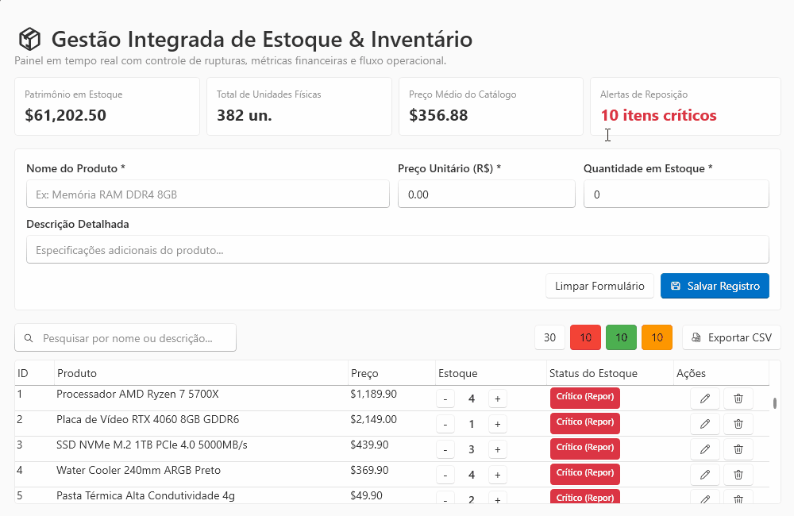

# Gestão Integrada de Estoque & Inventário

> Aplicação desktop para gerenciamento e controle de estoque desenvolvida em **C# / .NET 8**, utilizando **WPF-UI**, arquitetura **MVVM** e **PostgreSQL**.

<p align="center">
  
</p>

---

## 🚀 Funcionalidades Principais

- **Dashboard de KPIs em Tempo Real:** Indicadores consolidados de patrimônio total em estoque, unidades físicas, preço médio do catálogo e alertas de reposição.
- **Busca e Filtragem Reativa:** Pesquisa instantânea por nome ou descrição sem recarregamento de tela.
- **Categorização Visual por Criticidade:** Filtros rápidos por faixas operacionais com badges de status dinâmicos (crítico, normal e excedente).
- **Ações Rápidas de Estoque:** Ajuste direto de quantidades na tabela com atualização imediata de status e cores de alerta.
- **Gestão de Produtos (CRUD):** Formulário integrado para cadastro rápido e edição de itens com validação de campos.
- **Exportação de Relatórios:** Exportação dos registros do inventário diretamente para formato CSV.

## 🛠️ Tecnologias Utilizadas

- **Plataforma:** .NET 8 (C#)
- **Interface Gráfica:** WPF com [WPF-UI](https://github.com/lepoco/wpfui)
- **Arquitetura:** MVVM
- **ORM:** Entity Framework Core
- **Banco de Dados:** PostgreSQL

## 📂 Estrutura do Projeto

```text
├── assets/               # Imagens, demonstrações e GIF do README
├── Data/
│   ├── Context/          # DbContext do Entity Framework Core
│   └── Migrations/       # Histórico de migrações do banco de dados
├── Models/               # Entidades de domínio
├── Services/             # Regras de negócio e serviços
├── ViewModels/           # Lógica de apresentação e comandos MVVM
├── Views/                # Telas, janelas e controles XAML
├── appsettings.json      # Configurações da aplicação
└── App.xaml              # Inicialização da aplicação
```

## ⚙️ Pré-requisitos e Execução

### Pré-requisitos

- [.NET 8 SDK](https://dotnet.microsoft.com/download/dotnet/8.0) instalado.
- Servidor [PostgreSQL](https://www.postgresql.org/) ativo.

### Passo a Passo

1. **Clone o repositório:**

   ```bash
   git clone <URL_DO_REPOSITORIO>
   cd sistema-estoque
   ```

2. **Configure a conexão com o banco:**

   No arquivo `appsettings.json`, configure a string de conexão do PostgreSQL.

   Exemplo:

   ```json
   {
     "ConnectionStrings": {
       "DefaultConnection": "Host=localhost;Port=5432;Database=estoque_db;Username=postgres;Password=sua_senha"
     }
   }
   ```

3. **Execute as migrações do Entity Framework:**

   ```bash
   dotnet ef database update
   ```

4. **Compile e execute o projeto:**

   ```bash
   dotnet run
   ```

## 📄 Licença

Projeto desenvolvido para fins de controle interno e gerenciamento de estoque. Distribuído sob a licença MIT.
